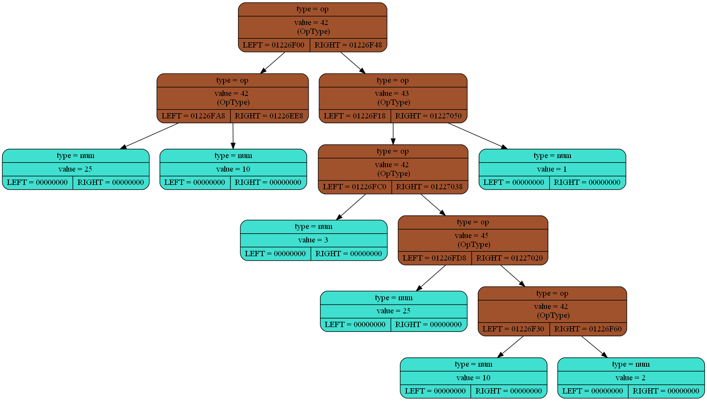

# Differentiator

Символьный дифференциатор выражений. Математическое выражение читается из файла, разбирается методом рекурсивного спуска, дифференцируется и преобразуется в бинарное дерево выражения и выгружается в формат Graphviz.

---

## Содержание

- [Сценарий работы](#сценарий-работы)
- [Реализовано](#реализовано)
- [Функционал](#функционал)
- [Сборка и запуск](#сборка-и-запуск)
- [Пример](#пример)
- [Выходные файлы](#выходные-файлы)
- [Структура проекта](#структура-проекта)


---

## Сценарий работы

1. программа читает выражение из текстового файла;
2. рекурсивный парсер строит AST (abstract syntax tree);
3. дерево сохраняется в файл `graf_dump.dot`;
4. через Graphviz автоматически генерируется изображение `graf_dump.png`.


---

## Реализовано

- чтение выражения из файла;
- синтаксический разбор методом рекурсивного спуска;
- поддержка целых чисел;
- поддержка бинарных операций:
  - `+`
  - `-`
  - `*`
  - `/`
- поддержка круглых скобок;
- построение бинарного дерева выражения;
- экспорт дерева в Graphviz `.dot`;
- генерация изображения дерева в `.png`.

---

## Функционал

На практике программа берёт выражение из файла `Expression.txt`, строит дерево и создаёт два артефакта:

- `graf_dump.dot` — текстовое описание графа;
- `graf_dump.png` — визуализация дерева.

Для входного выражения:

```text
25 * 10 * (3 * (25 - 10 * 2) + 1)$
```

получается дерево, которое отражает корректный приоритет операций:

- умножение и деление связываются сильнее, чем сложение и вычитание;
- скобки меняют порядок вычислений;
- выражение строится как бинарное дерево.

---

### Поддерживаемый формат входного выражения

- целые неотрицательные числа;
- операции `+`, `-`, `*`, `/`;
- круглые скобки `(` `)`;
- завершающий символ `$` в конце выражения.

Пример корректного ввода:

```text
2 + 3 * (10 - 4)$
```

### Используемая грамматика

Концептуально проект опирается на следующую грамматику:

```text
G ::= E$
E ::= T { ('+' | '-') T }*
T ::= P { ('*' | '/') P }*
P ::= '(' E ')' | N
N ::= ['0'..'9']+
```

Где:

- `G` — стартовое правило;
- `E` — выражение уровня сложения/вычитания;
- `T` — выражение уровня умножения/деления;
- `P` — число или выражение в скобках;
- `N` — целое число.

---

## Сборка и запуск

### Требования

Для сборки понадобятся:

- `g++`
- `make`
- `Graphviz` (`dot` должен быть доступен из командной строки)

Также в исходниках подключается `TXLib.h`. Если эта библиотека отсутствует в вашей среде, сборка может потребовать адаптации проекта под вашу систему.

### Сборка

```bash
make
```

В результате будет собран исполняемый файл:

```text
main.exe
```

### Запуск

В проекте предусмотрен стандартный сценарий запуска через `make`:

```bash
make run
```

Он выполняет программу с файлом `Expression.txt`:

```bash
./main.exe Expression.txt
```

Также можно запускать исполняемый файл напрямую, передав путь к файлу с выражением:

```bash
./main.exe Expression.txt
```

---

## Пример

### Вход

Файл `Expression.txt`:

```text
25 * 10 * (3 * (25 - 10 * 2) + 1)$
```

### Что произойдёт после запуска

1. выражение будет прочитано из файла;
2. парсер построит дерево выражения;
3. программа сформирует `graf_dump.dot`;
4. Graphviz создаст `graf_dump.png`.

### Семантика выражения

Дерево соответствует следующей структуре:

```text
(25 * 10) * ((3 * (25 - (10 * 2))) + 1)
```

Это подтверждает, что парсер корректно учитывает:

- приоритет `*` над `+` и `-`;
- вложенные скобки;
- левоассоциативную сборку бинарных операций.

---

## Выходные файлы

После успешного запуска в каталоге проекта появляются:

### `graf_dump.dot`

Описание дерева в формате Graphviz. Этот файл можно открыть вручную или использовать для повторной генерации изображения.

Пример ручной генерации PNG:

```bash
dot graf_dump.dot -T png -o graf_dump.png
```

### `graf_dump.png`

Готовая визуализация дерева выражения.



Цветовая схема узлов в текущей реализации:

- **голубой** — числовые узлы (`NUM`);
- **оранжевый** — узлы операций (`OP`);
- **фиолетовый** — переменные (`VAR`).

---

## Структура проекта

```text
.
├── main.cpp
├── RecursiveDescent.cpp
├── diff.cpp
├── Expression.txt
├── Makefile
├── graf_dump.dot
└── graf_dump.png
```

### Назначение основных файлов

- `main.cpp` — точка входа: чтение файла, запуск парсера, вызов визуализации;
- `RecursiveDescent.cpp` — логика рекурсивного спуска, чтение выражения и обработка синтаксических ошибок;
- `diff.cpp` — создание узлов дерева, Graphviz dump и заготовка под модуль дифференцирования;
- `Expression.txt` — пример входного выражения;
- `Makefile` — сценарии сборки и запуска.

---